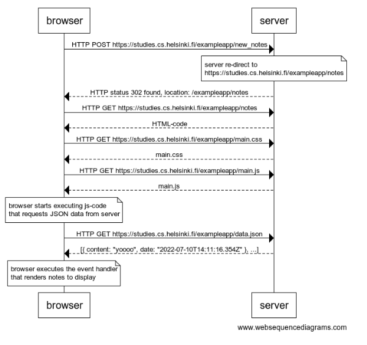
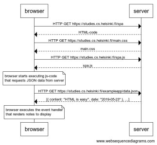

# [Fundamentals of Web apps](https://fullstackopen.com/en/part0/fundamentals_of_web_apps)

## 0.1: HTML

Review the basics of HTML by reading this tutorial from Mozilla: [HTML tutorial](https://developer.mozilla.org/en-US/docs/Learn/Getting_started_with_the_web/HTML_basics)

## 0.2: CSS

Review the basics of CSS by reading this tutorial from Mozilla: [CSS tutorial](https://developer.mozilla.org/en-US/docs/Learn/Getting_started_with_the_web/CSS_basics)

## 0.3: HTML forms

Learn about the basics of HTML forms by reading Mozilla's tutorial: [Your first form](https://developer.mozilla.org/en-US/docs/Learn/Forms/Your_first_form)

## 0.4: new note

Create a diagram depicting the situation where the user creates a new note on page https://fullstack-exampleapp.herokuapp.com/notes by writing something into the text field and clicking the submit button.

### Solution



By https://www.websequencediagrams.com/


```
browser->server: HTTP POST https://studies.cs.helsinki.fi/exampleapp/new_notes

note over server:
server re-direct to 
https://studies.cs.helsinki.fi/exampleapp/notes
end note

server-->browser: HTTP status 302 found, location: /exampleapp/notes
browser->server: HTTP GET https://studies.cs.helsinki.fi/exampleapp/notes
server-->browser: HTML-code
browser->server: HTTP GET https://studies.cs.helsinki.fi/exampleapp/main.css
server-->browser: main.css
browser->server: HTTP GET https://studies.cs.helsinki.fi/exampleapp/main.js
server-->browser: main.js

note over browser:
browser starts executing js-code
that requests JSON data from server
end note

browser->server: HTTP GET https://studies.cs.helsinki.fi/exampleapp/data.json
server-->browser: [{ content: "yoooo", date: "2022-07-10T14:11:16.354Z" }, ...]

note over browser:
browser executes the event handler
that renders notes to display
end note
```


## 0.5: Single page app

Create a diagram depicting the situation where the user goes to the single page app version of the notes app at https://fullstack-exampleapp.herokuapp.com/spa.

### Solution



By https://www.websequencediagrams.com/


```
browser->server: HTTP GET https://studies.cs.helsinki.fi/spa
server-->browser: HTML-code
browser->server: HTTP GET https://studies.cs.helsinki.fi/main.css
server-->browser: main.css
browser->server: HTTP GET https://studies.cs.helsinki.fi/spa.js
server-->browser: spa.js

note over browser:
browser starts executing js-code
that requests JSON data from server
end note

browser->server: HTTP GET https://studies.cs.helsinki.fi/exampleapp/data.json
server-->browser: [{ content: "HTML is easy", date: "2019-05-23" }, ...]

note over browser:
browser executes the event handler
that renders notes to display
end note
```


## 0.6: New note on Single page app

Create a diagram depicting the situation where user creates a new note using the single page version of the app.

